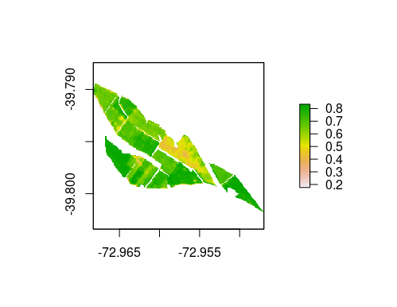
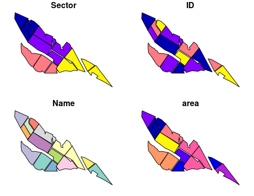
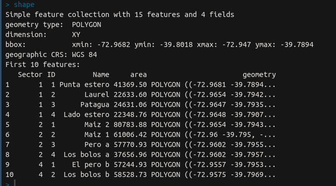
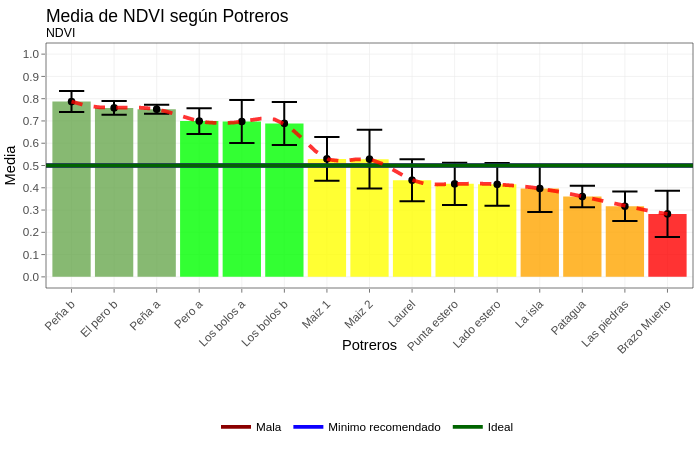
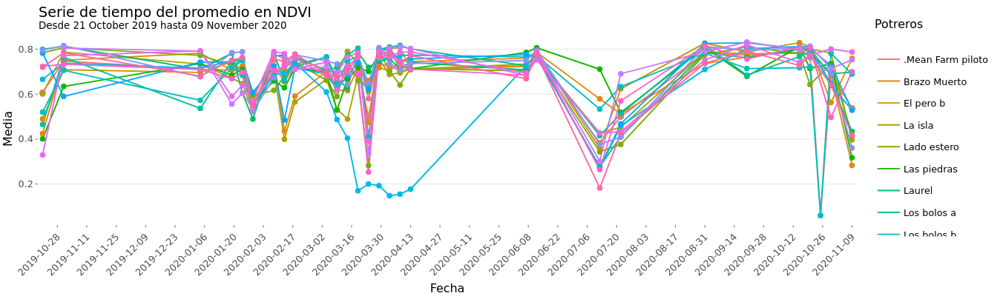

# ASAPI

AgroSpace API R Packages

More than 20 satellite scientific index to be use in your application. 

Full documentation in [api.agrospace.cl](api.agrospace.cl)


```
# install ASAPI

remotes::install_github('agrospace/ASAPI')

```

### Raster Layer

Satellite information base on pixel size of your farm. 




### Vectorial Layer


The vectorial layer contains attributable geometries to by assigned as paddocks names or similar information. 



### Stats by paddock


### Time series



