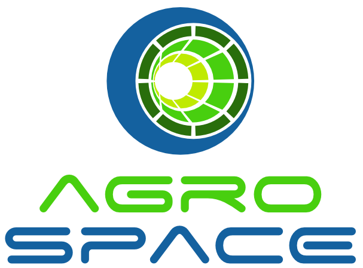
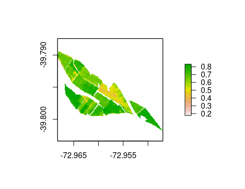
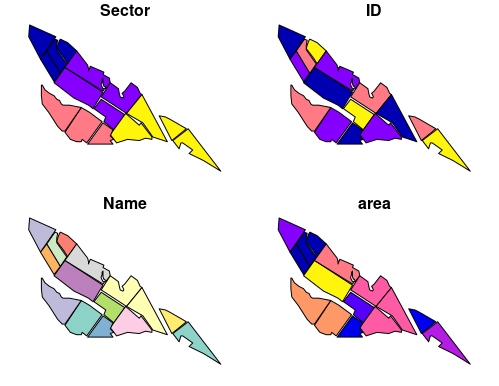
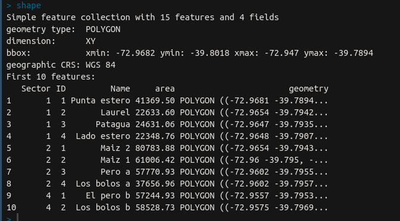
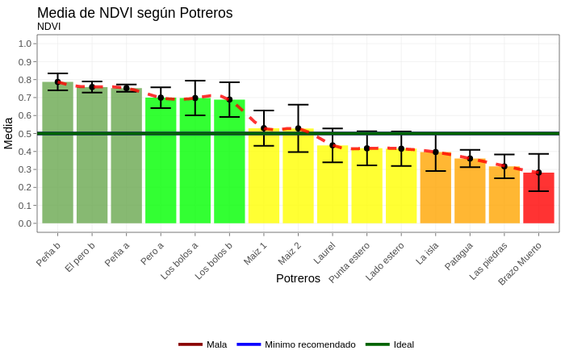
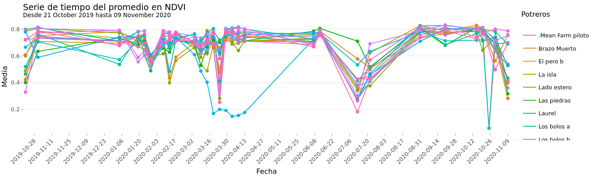

<!-- README.md is generated from README.Rmd. Please edit that file -->
<!-- badges: start -->

[](https://github.com/agrospace/ASAPI/actions)
<!-- badges: end -->

# ASAPI: **A**gro**S**pace **API** R Packages 

-   More than 20 satellite scientific index to be use in your
    application.
-   Satellite Biophysics index
-   Ready to use!

**OpenAPI** Full documentation in
[api.agrospace.cl](api.agrospace.cl/doc)

## Installation

``` r
remotes::install_github('agrospace/ASAPI')
```

### Raster Layer

Satellite information base on pixel size of your farm.



### Vectorial Layer



The vectorial layer contains attributable geometries to by assigned as
paddocks names or similar information.





### Time series



### GIF and Dashboards


## Code of conduct

Please note that this project is released with a [Contributor Code of
Conduct](https://api.agrospace.cl). By participating in this project you
agree to abide by its terms.
